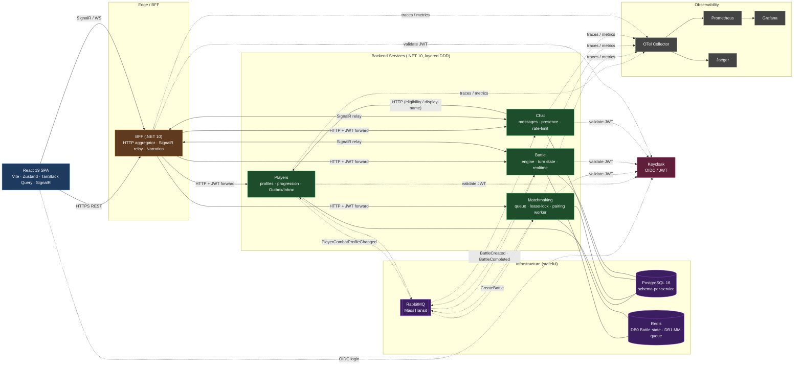

# ⚔️ Kombats

> A turn-based browser fighting game with an East-Asian aesthetic — built as a **production-grade microservice playground**.

Players create a fighter, allocate stats, queue for matchmaking, and fight 1-on-1 in real time (turns + a live battle commentator + chat). Under the hood it is **not a CRUD app** — the interesting part is distributed coordination, concurrency, and realtime: Clean Architecture, async messaging, Outbox/Inbox, distributed locks, a SignalR backplane, and a full observability stack.

<p>
  
  
  
  
  
  
  
  
</p>

---

## Architecture

The client talks **only** to the BFF (HTTP + SignalR). Backend services communicate **asynchronously over RabbitMQ** — the single synchronous cross-service exception is `Chat → Players`.



**Solid line** = synchronous (REST / SignalR). **Dashed line** = async message over RabbitMQ (label = event/command name). Battle and Matchmaking keep *hot* state in Redis; durable state lives in Postgres.

---

## Services

Each live service follows **layered DDD / Clean Architecture** (`Api/Bootstrap → Application → Domain`, `Infrastructure → Application/Domain`; Domain depends on nothing).

| Service | Responsibility | Notable engineering |
|---|---|---|
| **Players** | Profiles, character, stat progression | **Outbox + Inbox** for idempotent, transactional messaging |
| **Matchmaking** | Redis queue, presence, pairing | **Distributed lease-lock** so one replica pairs per tick; bounded pairing loop + idle backoff |
| **Battle** | Deterministic combat engine, turn state, realtime | Authoritative **state in Redis (+ Lua)**; **SignalR Redis backplane** for multi-replica realtime; recovery worker |
| **Chat** | Conversations, presence, retention | **Distributed rate-limit** over replicas |
| **BFF** | Single facade for the frontend | HTTP aggregation, JWT forwarding (Polly resilience), **SignalR relay**, battle-commentator narration pipeline |

### End-to-end gameplay loop

1. Login (Keycloak OIDC) → `Onboard` → character created (Players)
2. `AllocateStats` → Players publishes `PlayerCombatProfileChanged`
3. `JoinQueue` → Matchmaking enqueues (Redis); heartbeat keeps presence
4. Pairing worker finds a pair → publishes `CreateBattle`
5. Battle creates the fight (state in Redis), publishes `BattleCreated`, sends `BattleReady` realtime
6. Players take turns via BFF → engine resolves the turn → realtime events fan out through the BFF relay to both clients; the narration pipeline adds commentator lines
7. Battle ends → `BattleCompleted` → Players awards results, Matchmaking releases players

> Integration tests assert exactly this: `I01_PlayersToMatchmaking`, `I02_MatchmakingToBattle`, `I03_BattleCompletion`, `I04_EndToEndGameplayLoop`.

---

## Key patterns

| Pattern | Where | Why |
|---|---|---|
| Clean Architecture / layered DDD | every service | Domain isolated from infrastructure; testable |
| Backend-for-Frontend | `Kombats.Bff` | One facade: aggregation + auth forwarding + SignalR bridge |
| Outbox | Players | Atomic "write to DB + publish event" |
| Inbox / Idempotency | Players | Dedup of at-least-once deliveries |
| Distributed lease-lock | Matchmaking (`RedisLeaseLock`) | One pairer per tick across N replicas |
| State in Redis + Lua | Battle (`RedisBattleStateStore`) | Authoritative low-latency battle state, atomic ops |
| SignalR Redis backplane | Battle | Realtime across multiple replicas |
| Distributed rate-limit | Chat (`RedisRateLimiter`) | Flood protection across replicas |
| Result/Error railway | `Common.Abstractions` | Errors as values — no exceptions for control flow |
| Central Package Management | `Directory.Packages.props` | Single source of truth for package versions |
| Schema-per-service | PostgreSQL | Data isolation within one database |

---

## Tech stack

**Backend** — .NET 10 · EF Core + Npgsql · PostgreSQL 16 (schema-per-service) · MassTransit + RabbitMQ · StackExchange.Redis · ASP.NET Core SignalR (+ Redis backplane) · Keycloak (OIDC/JWT) · FluentValidation · Polly resilience · Serilog · OpenTelemetry · xUnit · NBomber + Locust (load tests)

**Frontend** — React 19 · Vite · React Router 7 · Zustand 5 · TanStack Query 5 · `@microsoft/signalr` 8 · oidc-client-ts + react-oidc-context · Tailwind CSS 4 · Radix UI · Motion (Framer) · Vitest · TypeScript

The frontend follows a strict 4-layer architecture (`app / modules / transport / ui`) with hard isolation rules — auth tokens are kept **in memory only** (no `localStorage`), and all network access goes through `transport/`.

---

## Repository structure

```
Kombats/
├── src/
│   ├── Kombats.Battle/        # combat engine, turn state, recovery, realtime
│   ├── Kombats.Matchmaking/   # queue, lease-locks, pairing ticks
│   ├── Kombats.Players/       # profiles, progression, Outbox/Inbox
│   ├── Kombats.Chat/          # chat, presence, rate-limit, retention
│   ├── Kombats.Bff/           # Backend-for-Frontend (API + SignalR relay)
│   ├── Kombats.Common/        # Abstractions / Messaging / Observability
│   ├── Kombats.Migrator/      # EF migrations runner image
│   └── Kombats.Client/        # React 19 + Vite SPA
├── tests/                     # unit/component per service + Integration + LoadTests
├── infra/                     # Bicep IaC + Keycloak bootstrap (realm/clients/themes)
├── observability/             # Grafana / Prometheus / OTel Collector configs
├── pipelines/                 # Azure DevOps CI/CD
├── scripts/                   # deploy-stack, run-migrations, show-tree
└── docker-compose.*.yml       # local / full-stack / multi-replica / capacity
```

---

## Getting started

> Prerequisites: Docker + Docker Compose, .NET 10 SDK (for IDE mode).
> Add `127.0.0.1 keycloak` to your `/etc/hosts` so OIDC redirects resolve.

### Mode A — Full stack (default)

All backend services + infrastructure + observability:

```bash
docker compose \
  -f docker-compose.yml \
  -f observability/docker-compose.observability.yml \
  -f observability/docker-compose.observability.override.yml \
  -f docker-compose.override.yml \
  up -d --build
```

> ⚠️ The `observability.override.yml` file is **required** — without it services start with an empty `OtlpEndpoint` and silently drop telemetry. A defensive `WARN Kombats.Observability` log surfaces this if your compose chain is wrong.

### Mode B — Multi-replica

Mode A plus a second Battle replica (tests the SignalR backplane / sustained capacity):

```bash
docker compose \
  -f docker-compose.yml \
  -f observability/docker-compose.observability.yml \
  -f observability/docker-compose.observability.override.yml \
  -f docker-compose.override.yml \
  -f docker-compose.multi-replica.yml \
  up -d --build
```

### Mode C — IDE mode

Only the stateful infrastructure (Postgres / Redis / RabbitMQ / Keycloak); run the .NET services from your IDE or `dotnet run`:

```bash
docker compose -f docker-compose.local.yml up -d
```

---

## Testing

```bash
dotnet test                      # unit, component & integration tests
```

Load tests live in `tests/Kombats.LoadTests/` (NBomber + a Locust migration) — see its `README.md`.

---

## Deployment

Infrastructure as Code targets **Azure Container Apps** via Bicep (`infra/main.bicep` → `workload.bicep`): Container Apps Environment, stateful apps (Postgres/Redis/RabbitMQ), the five backend apps, Keycloak, a migration job, and a static web app for the frontend. Container images are published to GHCR. CI/CD is defined under `pipelines/` (Azure DevOps).


