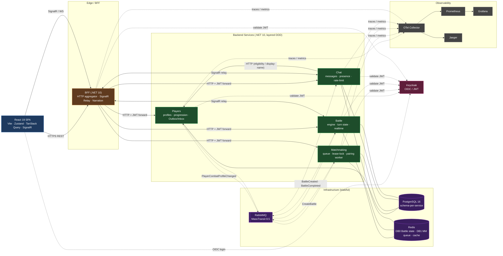

# Kombats — C4 Container Diagram (карта сервисов)

Высокоуровневая карта системы: контейнеры и связи. Источник — реальный код эталона
(`§1–§3, §7` knowledge-файла). Сплошные линии = синхронно (REST/SignalR),
пунктир = async через RabbitMQ.

**Легенда**
- **Сплошная** стрелка с подписью протокола — синхронный вызов (REST / SignalR).
- **Пунктир** — асинхронное сообщение через RabbitMQ (на стрелке — имя события/команды).
- Клиент общается **только** с BFF. Сервисы между собой — через шину; единственное синхронное
  межсервисное исключение — Chat → Players (HTTP).
- Battle и Matchmaking держат «горячее» состояние в Redis, устойчивое — в Postgres.
