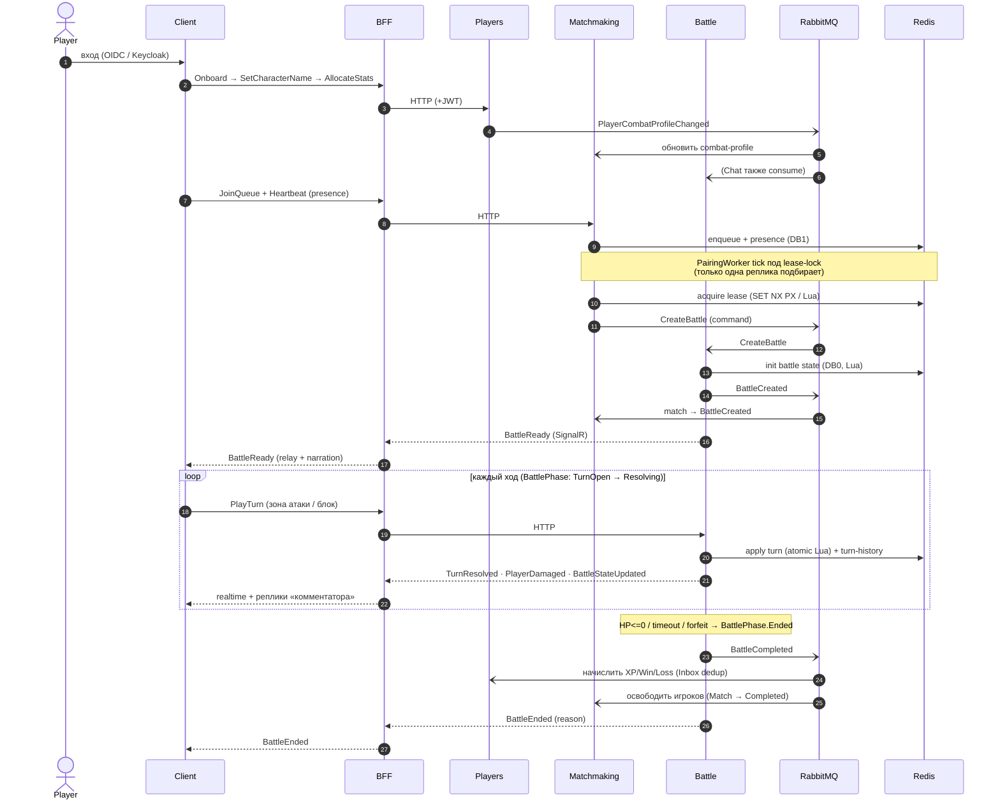

# Kombats — Messaging & Gameplay-loop (sequence + каталог событий)

Сквозной путь от входа игрока до завершения боя. `->>` = синхронный HTTP/вызов,
`-)` = публикация/доставка через RabbitMQ (async, at-least-once).

## Каталог сообщений

| Сообщение | Тип | Producer | Consumer(s) | Назначение |
|---|---|---|---|---|
| `PlayerCombatProfileChanged` | event | Players | Matchmaking, Chat | Боевой профиль/имя изменились (после AllocateStats и т.п.) |
| `CreateBattle` | command | Matchmaking | Battle | Создать бой для подобранной пары |
| `BattleCreated` | event | Battle | Matchmaking | Бой создан → матч переходит в `BattleCreated` |
| `BattleCompleted` | event | Battle | Players, Matchmaking | Итог боя → начисление прогресса + освобождение игроков |
| `TurnOpenedRealtime`, `TurnResolvedRealtime`, `AttackResolutionRealtime`, `PlayerDamagedRealtime`, `BattleStateUpdatedRealtime`, `BattleReadyRealtime`, `BattleEndedRealtime`, `BattleSnapshotRealtime` | realtime | Battle | Battle internal SignalR → **BFF Relay** → Client | Покадровое состояние боя для обоих клиентов |

**Ключевые заметки**
- **Idempotency:** Players дедуплицирует входящие события через **Inbox** (`InboxMessage`,
  PK `MessageId`) — защита от повторной доставки.
- **Lease:** в момент подбора только одна реплика Matchmaking держит lease — нет двойного матча.
- Realtime-события не идут в шину игрокам напрямую: Battle → internal hub → **BFF Relay** → клиент.
