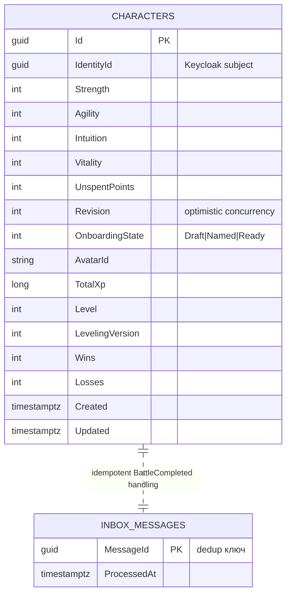
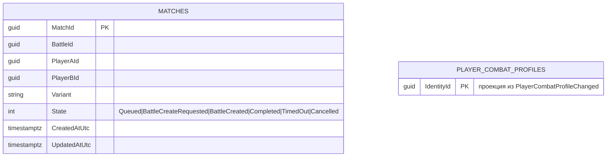
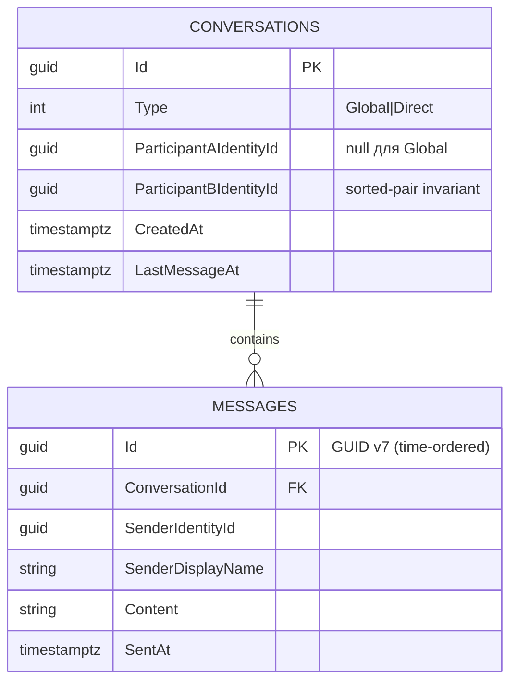
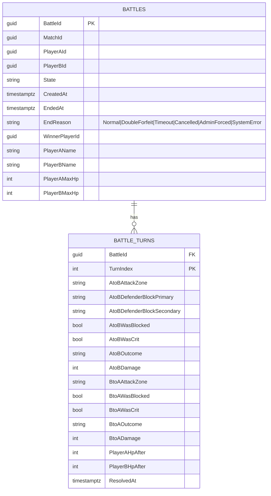

# Kombats — ER-схемы баз данных (schema-per-service)

PostgreSQL 16, **схема на сервис** (`players`, `matchmaking`, `chat`, `battle`).
Поля взяты из реальных доменных/EF-сущностей эталона. «Горячее» состояние (очередь,
presence, состояние активного боя) живёт в **Redis**, не в Postgres — отмечено в конце.

## players (schema: `players`)

> Плюс таблицы **Outbox** (MassTransit, миграция `AddOutboxEntities`) — транзакционная публикация.

## matchmaking (schema: `matchmaking`)

> Очередь подбора, presence и lease-lock — **в Redis (DB1)**, не в этой схеме.

## chat (schema: `chat`)

> Presence и rate-limit — **в Redis**. Ретенция старых сообщений — `MessageRetentionWorker`.

## battle (schema: `battle`)

> Postgres хранит **историю завершённых боёв** (для feed/recovery). **Авторитетное состояние
> активного боя — в Redis (DB0)** (`RedisBattleStateStore` + Lua), оттуда же `BattleRecoveryWorker`
> восстанавливает бои после рестарта.

## Что в Redis, а что в Postgres

- **Redis (эфемерное, low-latency, atomic):** очередь подбора и presence (MM, DB1),
  lease-lock, состояние активного боя + ходы в полёте (Battle, DB0), rate-limit и presence чата,
  кэш профилей.
- **Postgres (устойчивое, реляционное):** профили/прогрессия игроков, история матчей,
  история завершённых боёв и ходов, сообщения чата, Outbox/Inbox.
- Почему так: для боя важны латентность и атомарные операции (Lua), а presence/rate-limit
  естественно живут с TTL — это плохо ложится в реляционную модель.

> Поля `players`/`matchmaking` отчасти усечены — для полного списка колонок сверяться с
> `*DbContext` + EF-миграциями соответствующего сервиса.
