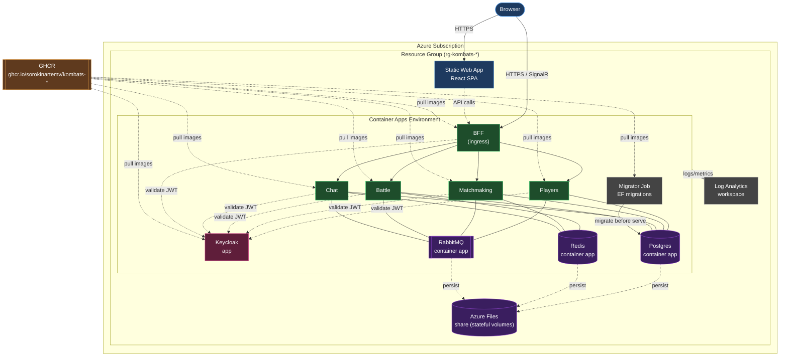

# Kombats — Deployment Diagram (Azure Container Apps)

Как система разворачивается в Azure через Bicep (`infra/main.bicep` → `workload.bicep` → modules).
Образы тянутся из GHCR.

## Какой Bicep-модуль что разворачивает

- `main.bicep` (subscription scope) → создаёт **Resource Group** → вызывает `workload.bicep`.
- `workload.bicep` → Log Analytics, **Container Apps Environment**, и модули:
  - `storage.bicep` + `env-storage.bicep` → Azure Files share + монтирование в Environment.
  - `stateful-app.bicep` → Postgres / Redis / RabbitMQ как Container Apps.
  - `backend-app.bicep` → 5 backend-сервисов (Players/Matchmaking/Battle/Chat/BFF).
  - `keycloak-app.bicep` → Keycloak (+ отдельная БД/bootstrap).
  - `migrator-job.bicep` → Job, прогоняющий EF-миграции до старта сервисов.
  - `static-web-app.bicep` → хостинг React SPA.

> Образы публикуются в GHCR пайплайнами Azure DevOps (`azure-pipelines.yml`,
> `pipelines/build-backend.yml`, `deploy-stack.yml`). Детали ingress/секретов — в самих модулях.
