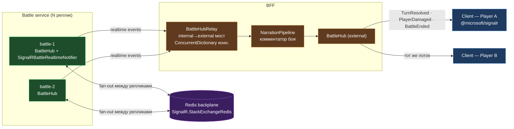
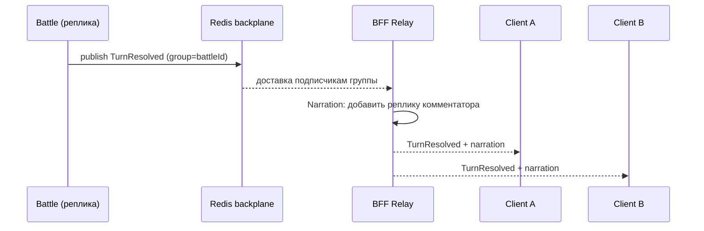

# Kombats — Realtime / SignalR Relay

Как событие боя доходит до обоих игроков, и зачем нужны Relay + Redis backplane.

### Один ход — sequence

**Зачем так**
- **Redis backplane** — клиенты одного боя могут висеть на разных репликах Battle; backplane
  рассылает событие всем репликам группы (+ skip-negotiation для прямого WS-коннекта).
- **BFF Relay** — клиент не коннектится к Battle напрямую: BFF держит единый внешний хаб,
  пробрасывает auth, управляет состоянием коннекций и обогащает поток нарративом. Это и
  изоляция (фронт знает только BFF), и точка для комментатора/агрегации.
