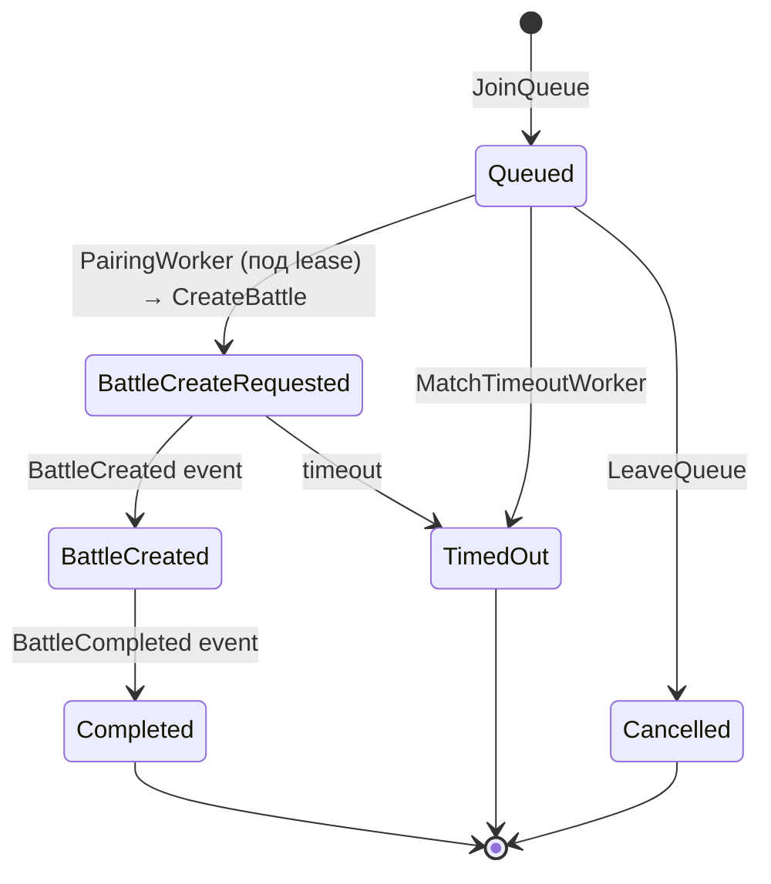
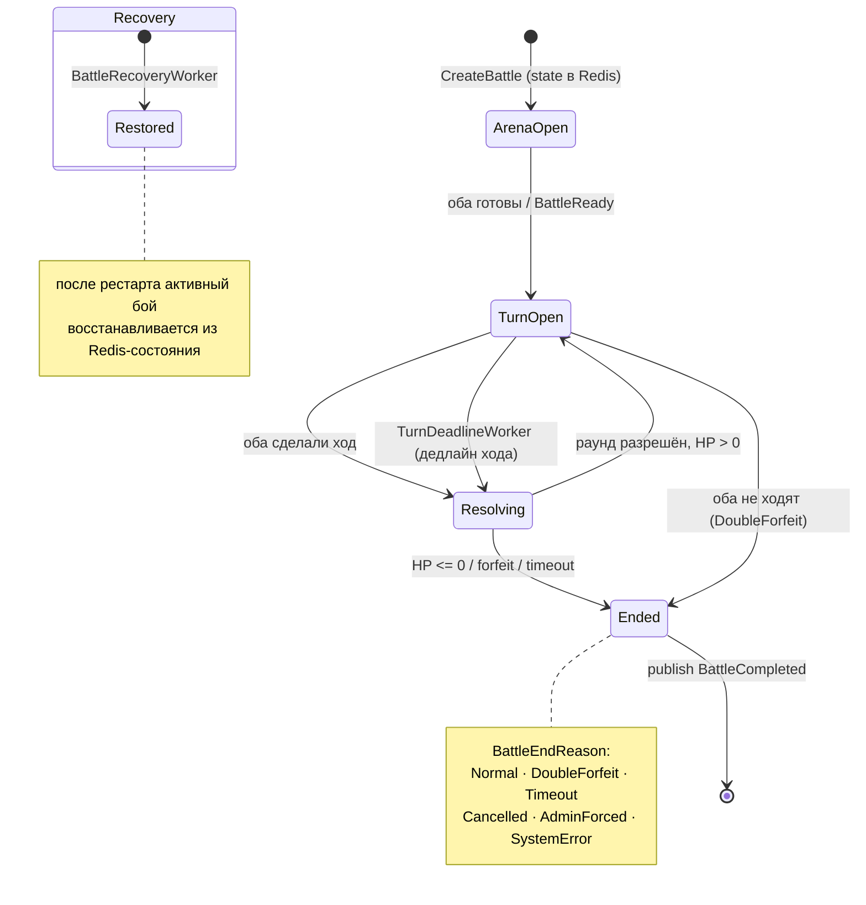

# Kombats — State machine (матч + бой)

Жизненный цикл от подбора до завершения. Состояния и причины — из реальных enum-ов эталона
(`MatchState`, `BattlePhase`, `BattleEndReason`).

## Match (Matchmaking) — `MatchState`

## Battle — `BattlePhase` + `BattleEndReason`

**Триггеры (легенда)**
- `CreateBattle` — команда от Matchmaking создаёт бой (состояние инициализируется в Redis).
- Ход игрока — выбор зоны атаки/блока через BFF → применяется движком.
- `TurnDeadlineWorker` — если игрок не походил вовремя, ход форсируется/таймаутится.
- HP `<= 0` (`PlayerState.IsDead`) → `Ended` с `Normal`.
- Оба не ходят → `DoubleForfeit`; общий таймаут → `Timeout`.
- `BattleRecoveryWorker` — восстановление активных боёв после рестарта реплики из Redis.
