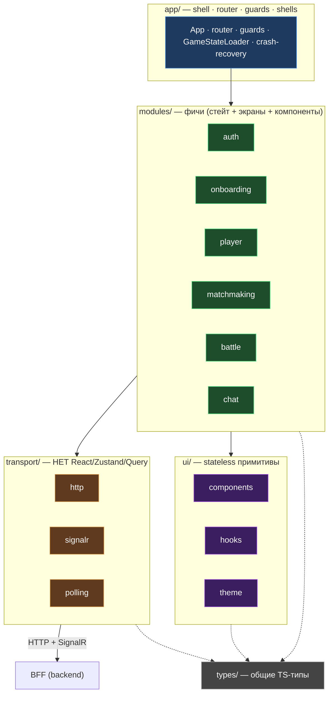

# Kombats — Frontend 4-слойная архитектура

React 19 SPA. Слои и реальные папки из `src/Kombats.Client/src`. Стрелки — разрешённые
зависимости (сверху вниз). Запрещённые направления — в таблице.

## Forbidden patterns — правило → почему

| Правило | Почему |
|---|---|
| Сетевые вызовы только через `transport/` (нет `fetch()` / `new HubConnection()` в компонентах) | Изоляция транспорта, тестируемость, единая точка ретраев/ошибок |
| `transport/` без React / Zustand / TanStack Query | Транспорт — чистый, переиспользуемый, без UI-зависимостей |
| `ui/` — stateless (без сторов и транспорта) | Примитивы переиспользуемы и предсказуемы |
| Модуль не пишет в чужой стор | Границы фич, нет скрытых связей |
| Auth-токены только в памяти (не `localStorage`) | XSS-риск из-за чата (DEC-6) |
| Данные через TanStack Query, не `useEffect` | Кэш, ретраи, инвалидация из коробки |
| Роуты — проекция состояния (нет `navigate()` в фичах) | Предсказуемая навигация, единый источник истины |
| Только Tailwind + CSS-переменные; named exports; без `React.FC`; без `any` | Единый стиль, strict TypeScript |
