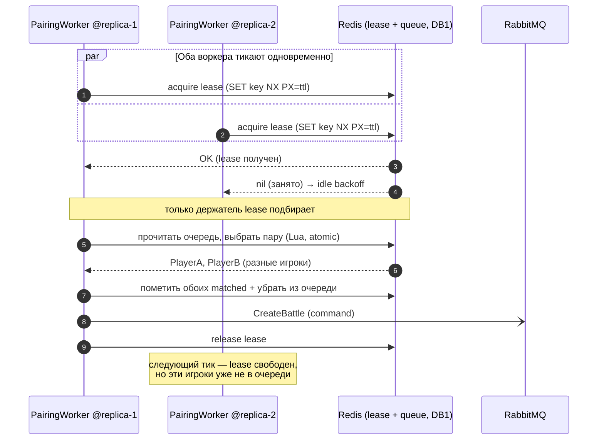

# Kombats — Matchmaking concurrency (lease-lock)

Как несколько реплик Matchmaking подбирают пары, не создавая дублей. Изюминка проекта:
`RedisLeaseLock` + `MatchmakingLeaseService` + `MatchmakingPairingWorker`.

**Какие race conditions это закрывает**
- **Двойной матч одной пары** — без lease две реплики могли бы одновременно вытащить тех же
  игроков и создать два боя. Lease гарантирует одного подборщика в момент тика.
- **Игрок в двух матчах** — атомарная Lua-операция «выбрать пару + пометить matched + убрать
  из очереди» исключает гонку чтения-записи очереди.
- **Залипший lease** — `PX=ttl` (lease с истечением): если держатель упал, lock сам отпустится.
- **Холостое сжигание CPU** — `MatchmakingPairingWorker` использует bounded loop + idle backoff:
  не крутится вхолостую, когда очередь пуста.

> Точная реализация Lua и параметры lease — в `RedisScripts.cs`, `RedisLeaseLock.cs`,
> `MatchmakingLeaseService.cs`, `MatchmakingPairingWorker.cs`.
